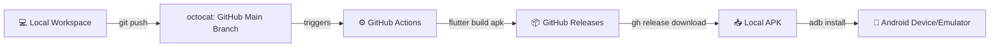

# 🎮 TicTacToe Flutter App

An awesome cross-platform **TicTacToe Game** built using **Flutter**.

---

## 🚀 Development & Build Architecture

This project follows a streamlined **Cloud Build & Automated Release Workflow**:



1. **Local Coding (`/lib`)**: All feature development, game logic, and UI design happen locally in the workspace.
2. **Cloud Building (GitHub Actions)**: Builds are offloaded to GitHub Actions (`.github/workflows/build-release.yml`) so local system resources stay free.
3. **Automated Releases**: Every push to `main` creates a tagged GitHub Release with the compiled `app-release.apk`.
4. **ADB Deployment**: Fetch the latest APK via `gh` CLI and deploy instantly to connected Android devices or emulators.

---

## 🛠️ Quick Commands Guide

### 1. Push Code Updates
```bash
git add .
git commit -m "feat: updated game logic"
git push origin main
```

### 2. Monitor GitHub Actions Build
```bash
gh run list
gh run watch <RUN_ID>
```

### 3. Download & Install Latest Release APK
```bash
# Download latest release APK
gh release download --dir downloads/

# Install on connected emulator / device via ADB
adb install -r downloads/app-release.apk
```

---

## 📄 Documentation

For full details on the development workflow and release process, see [WORKFLOW.md](./WORKFLOW.md).
